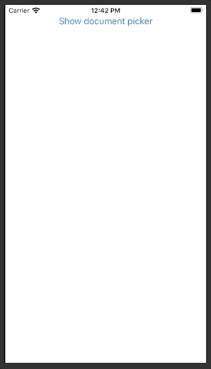

**DocumentPicker** is a _SwiftUI_ view modifier to show/hide the system's document picker. Fully compatible with the _macOS_, _iOS_, _iPadOS_ and _Mac Catalyst_ platforms.



# Example

```swift
struct ContentView: View {

  @State var showDocPicker = false

  var body: some View {
    Button("Show document picker") {
      self.showDocPicker.toggle()
    }
    .documentPicker(
      isPresented: $showDocPicker,
      documentTypes: ["public.folder"],
    ) { urls in
      print("Selected folder: \(urls.first!)")
    }
  }
}
```

More info [in the docs](doc).

# Installation via SPM

In _XCode_ add the following URL to your project's _Swift Package_ dependencies:

 `https://github.com/swiftuilib/document-picker`

# Development

To modify the package contents while still being able to see SwiftUI _Previews_ use the provided `DocumentPickerPreview.xcodeproj`.
